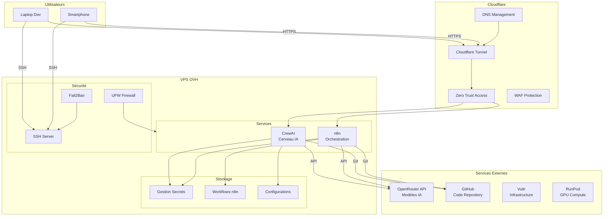

# Architecture du Système

Ce document décrit l'architecture globale du système d'autonomie financière.

## Vue d'ensemble

Le système est conçu pour être modulaire, sécurisé et évolutif. Il utilise CrewAI comme cerveau principal pour l'automatisation intelligente et n8n pour l'orchestration des workflows.

## Architecture Générale



## Composants Principaux

### 1. CrewAI (Cerveau IA)

**Rôle**: Cerveau principal du système, responsable de la prise de décision intelligente et de l'automatisation.

**Fonctionnalités**:
- Agents IA spécialisés
- Analyse de données financières
- Prise de décision automatisée
- Communication avec les services externes

**Configuration**:
- Fichier: `crewai/config/settings.yaml`
- Variables d'environnement: `CREWAI_*`

**Accès**: https://crewai.1bonobo1.com

### 2. n8n (Orchestration)

**Rôle**: Orchestration des workflows et automatisation des tâches.

**Fonctionnalités**:
- Workflows automatisés
- Intégrations avec services externes
- Déclencheurs temporels et événementiels
- Gestion des données

**Configuration**:
- Workflows: `n8n/workflows/`
- Variables d'environnement: `N8N_*`

**Accès**: https://n8n.1bonobo1.com

### 3. Cloudflare (Sécurité et Accès)

**Rôle**: Protection et accès sécurisé aux services.

**Composants**:
- **Cloudflare Tunnel**: Accès sécurisé sans exposition de ports
- **Zero Trust Access**: Authentification et autorisation
- **WAF**: Protection contre les attaques
- **DNS**: Gestion du domaine 1bonobo1.com

**Configuration**:
- Tunnel: `infrastructure/cloudflare/tunnel.yml`
- Access: Dashboard Cloudflare Zero Trust

### 4. Infrastructure de Sécurité

#### SSH
- Authentification par clés uniquement
- Configuration: `infrastructure/ssh/config`
- Hardening automatique via script setup.sh

#### Firewall (UFW)
- Règles par défaut: deny incoming, allow outgoing
- Ports autorisés: SSH, HTTP, HTTPS
- Configuration: `infrastructure/firewall/ufw-rules.sh`

#### Fail2Ban
- Protection contre les attaques par force brute
- Configuration automatique via script setup.sh

## Flux de Données

### 1. Accès Utilisateur

```
Utilisateur (Laptop/Smartphone)
  ↓ HTTPS
Cloudflare Tunnel
  ↓ Zero Trust Access
Service (CrewAI/n8n)
```

### 2. Communication avec Services Externes

```
CrewAI/n8n
  ↓ API Request
OpenRouter
  ↓ Response
CrewAI/n8n
  ↓ Processing
Action/Decision
```

### 3. Gestion des Secrets

```
Fichier .env (local)
  ↓ Environment Variables
Docker Containers
  ↓ Secure Access
External APIs
```

## Structure Modulaire

### Dossiers Principaux

- **`infrastructure/`**: Configuration de l'infrastructure (Cloudflare, SSH, Firewall)
- **`crewai/`**: Module CrewAI avec agents et configurations
- **`n8n/`**: Module n8n avec workflows
- **`scripts/`**: Scripts d'automatisation (setup, deploy, backup)
- **`docs/`**: Documentation du projet
- **`secrets/`**: Gestion des secrets (gitignored)

### Avantages de la Structure Modulaire

1. **Séparation des préoccupations**: Chaque module a sa responsabilité
2. **Évolutivité**: Facile d'ajouter de nouveaux modules
3. **Maintenance**: Chaque module peut être mis à jour indépendamment
4. **Sécurité**: Isolation des composants

## Évolutions Futures

Le système est conçu pour évoluer selon les besoins:

1. **Nouveaux Agents CrewAI**: Ajout facile dans `crewai/agents/`
2. **Nouveaux Workflows n8n**: Ajout dans `n8n/workflows/`
3. **Nouveaux Services**: Ajout dans `docker-compose.yml`
4. **Nouvelles Intégrations**: Configuration dans les modules respectifs

## Ressources Système

### VPS OVH
- **CPU**: 6 vCPU
- **RAM**: 12 GB
- **Disk**: 100 GB

### Allocation Recommandée
- **CrewAI**: 4 GB RAM, 2 vCPU
- **n8n**: 2 GB RAM, 1 vCPU
- **Cloudflared**: 512 MB RAM, 0.5 vCPU
- **Système**: 2 GB RAM, 1 vCPU
- **Marge**: 3.5 GB RAM, 1.5 vCPU

## Monitoring

### Logs
- Tous les services génèrent des logs
- Accessibles via `docker-compose logs`
- Rotation automatique configurée

### Santé des Services
- Healthchecks configurés dans docker-compose.yml
- Monitoring via Cloudflare Analytics

## Sécurité

Voir `docs/security.md` pour les détails complets de sécurité.

## Déploiement

Voir `docs/deployment.md` pour le guide de déploiement complet.
